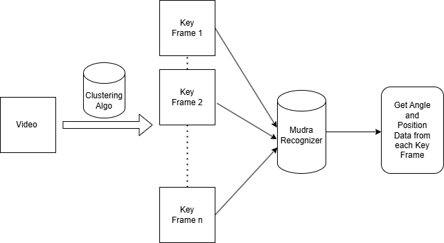

# Trials for Kathakali Ontology Research

## Creating Conda environment
```
conda create -n mudra python=3.9 anaconda
conda activate mudra
```

## Installing Requirements
```
pip install -r requirements.txt
```

## Pipeline


## Generating Mudra Keypoint Images using mediapipe
```
python generate_pose_image.py
```

## Calculating angles and postion data of a frame
- change the path inside main() function to test with custom images
```
python angles.py
```

